# Lecture2:Introduction to Modern SNARKs

# Overview about zk-SNARK

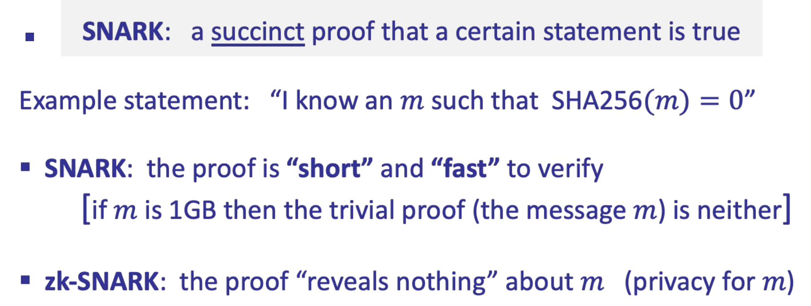

## Why commercial so much

历史可追溯至 1991 年的一篇论文[Babai-Fortnow-Levin-Szegedy'91]

## Zk-snark application

- blockchian

  - 外包计算：
    - 扩容(zkRollup)：离线服务处理交易批次，L1 链验证一个简短的证明来证明该批次内的交易都是有效的,而无需分别验证每笔交易
    - 区块链桥接（zkBridge）：将资产从源链转移到目标链.源链的共识协议同意锁定某些资产，以便在另一个链中使用。通过验证 zksnark 生成关于源链到目标链的共识状态的简短证明,而无需验证源链共识的整个过程.
      在上述两个例子中,非交互式证明非常重要。因为证明需要由大量区块链验证者进行验证
  - 隐私性:**需要零知识性**
    - 公共区块链上的隐私交易：ZKP 在不泄漏交易信息的情况下证明一个私人交易是有效的。例子：TornadoCash、ZCash、Ironfish、Aleo。
    - 合规性：证明一个私人交易符合银行法规（例如 Espresso）
      证明一个交易所具有偿付能力而无需泄漏拥有资产情况（例如 Raposa）。
- Non-blockchain:打击虚假信息, [[Kang-Hashimoto-Stoica-Sun'22]](https://arxiv.org/abs/2211.04775)

当阅读报纸文章时,文章通常会插有图片,但图片可能与文章内容完全无关甚至带有误导性质.

解决方案是 **C2PA 标准**,其代表内容来源和真实性,目标是为报纸文章中的图像提供真实的出处。

工作原理:在每台相机中嵌入一个由制造商嵌入的密钥。该密钥无法从相机中提取出

每次符合 C2PA 标准的相机拍摄照片时，会对照片以及与该照片关联的所有元数据进行签名,比如拍摄照片的位置和时间戳,然后嵌入到相机生成的原始图像数据中.

当图像嵌入文章并发送给读者时，读者可以简单地验证图像上的签名，并向读者显示元数据、位置和时间戳.

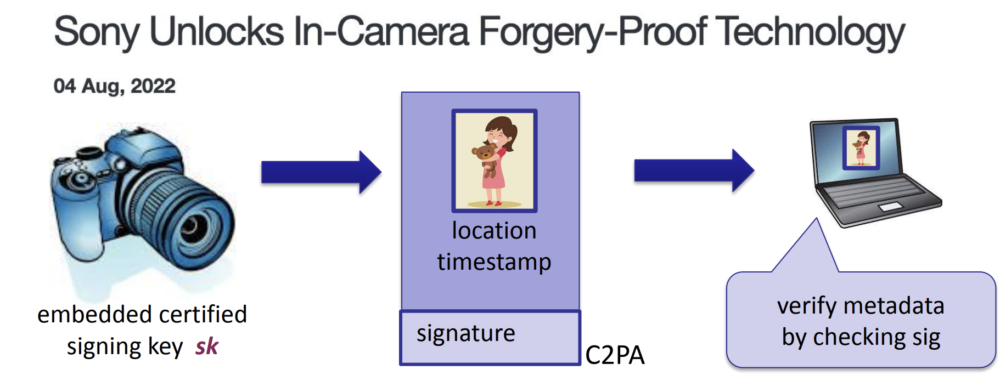

但 C2PA 标准有一个后处理的问题,即这些相机可捕捉非常高分辨率的图像。

但是为避免将图像发送给最终用户时浪费太多带宽,发送时会对图像采样.这意味着图像可能被重新调整为更低的分辨率，会被裁剪，会进行灰度化处理等.当将经过处理的照片发送到笔记本电脑时，笔记本电脑无法再验证图像上的 C2PA 签名。即**必须拥有原始图像数据，否则无法验证签名。**

所以问题就是：签名存在，但读者没有获得原始图像数据，因此无法验证签名是否有效。

采用 zk-snark 解决,思想:在图片被编辑前,为该图片生成一个 zk-snark proof.

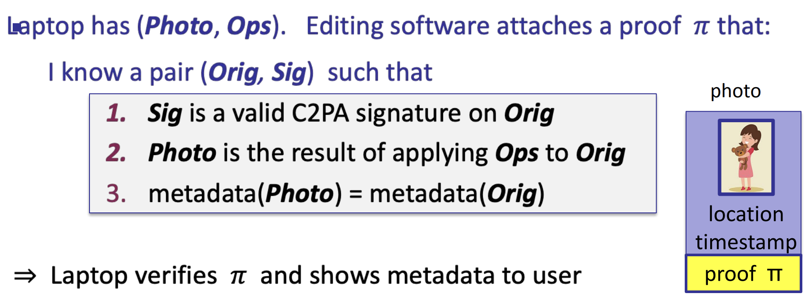

Operation 表示应用于该照片的操作列表:例如缩小尺寸、灰度化、裁剪

读者验证 zk-SNARK 证明,如果有效则将向用户显示元数据.

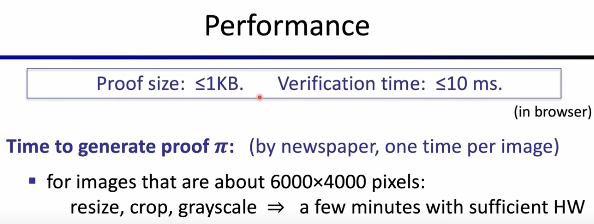

# Define zksnark

首先介绍电路部分

## Arithmetic Circuits

Fix a **finite field** F={0,1,…,p-1} for some prime _p_>2


Arithmetic Circuits 是一个函数，它接受有限域中元素作为输入并产生有限域中的元素作为输出。

它由若干域上的加法门和乘法门组成. 电路的大小=电路中门的数量,如上图 |C|=3.

**电路可满足问题** (circuit satisfiability problem, C-SAT) 是指给定电路 C、 电路的部分输入 x (x 可为空) 和电路输出 y, 判断是否存在证据 w (电路的另一部分输入, 视为秘密输 入) 使得 C(x, w) = y.

**布尔电路**(Boolean circuit)是算术电路的子类, 其仅有与门、异或门等布尔逻辑门, 变量取值仅为 0 或 1. 可以证明, 通过增加常数级别的电路门和深度, **任何布尔电路都可以转换为算术电路**

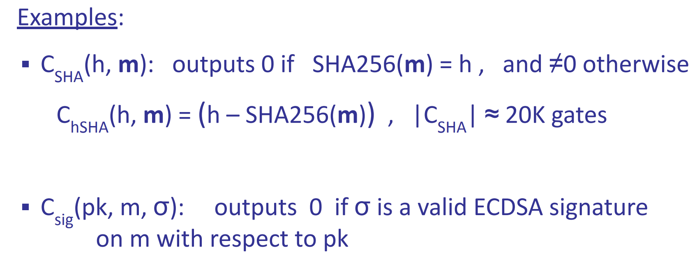

**Valiant's theorem**:所有多项式时间可计算的函数都可以通过多项式大小的算术电路来表示

仅使用加法、乘法和减法，就可以实现 SHA256 函数，大约需要 20,000 个门才能完成，

### Structured vs. unstructured circuits

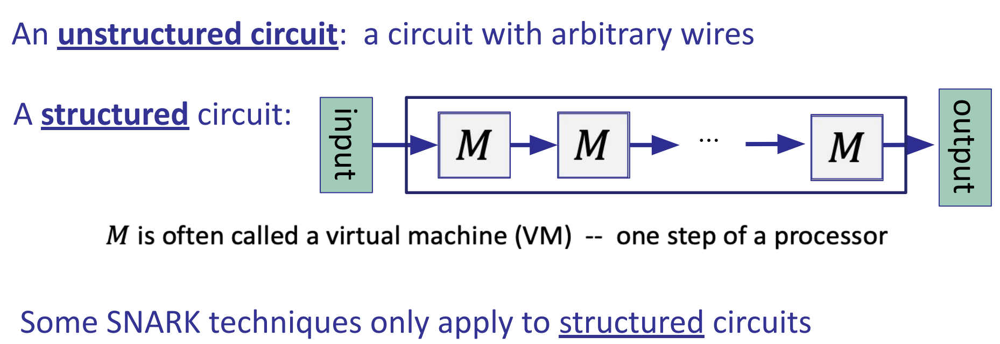

非结构化电路:电路中有一堆门，而电线只是按照开发人员想要的方式去连接门

结构化电路:电路本身实际上是分层构建的，其中有一个固定的算术电路 M。

```
          输入从底部进入，重复应用M，最后计算输出。
```

M 有时被称为虚拟机

## NARK: Non-interactive ARgument of Knowledge

NARK 代表非交互式知识论证,其**应用于算数电路**

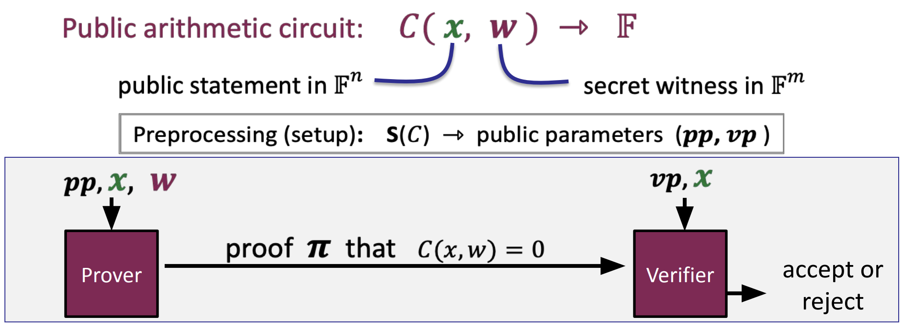

电路的输入:公共 statement x 与秘密 w; 输出仍是 F 中的元素

NARK 会经过一个 Setup 阶段即预处理,Setup 将电路的描述作为输入,产生一些公共参数作为输出.

其中一部分参数与 Prover 相关,称为 PP.另外一些参数与 Verifier 相关,称为 VP.

Prover 通过 PP,x,w 作为输入,产生一个 proof .表明 C(x,w)=0.

Verifier 通过 PP,x 作为输入,对该 proof 进行验证.

整个过程 Prover 与 Verifier 并没有**交互**.

### Define NARK  Normallly

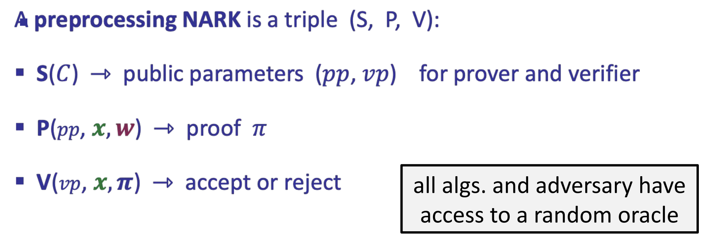

### Properties of NARK

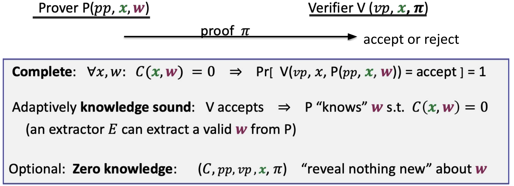

## Knowledge soundness

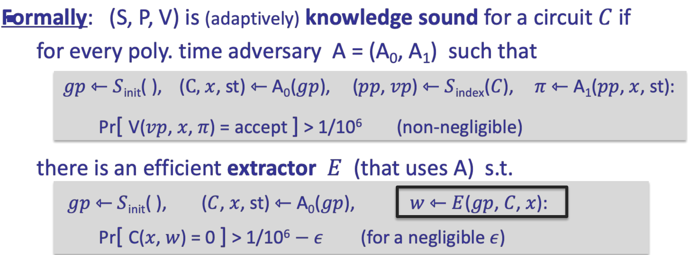

Verifier 接受 w,表示 Prover know w.st C(x,w)=0 成立.如何理解 konw 呢,这就是第一节提到的提取器的概念

非正式来说,w 能够以某种方式从 Prover 中提取到 w,则表示 Prover know w.

正式定义则如上图.对于多项式时间对手 A 试图充当恶意证明者,在不知道 statement 对应的 w 情况下通过 Verifier 的验证,其中 A 分为两个算法,A0 与 A1.过程如下

1. 生成全局参数 gp
2. 将全局参数提供给第一个敌手算法 A0，敌手将生成一些内部状态 st,伪造证明的电路 C 和 statement x
3. 生成 PP 与 VP
4. 将 PP,C,x 作为输入运行算法 A1,A1 输出一个 proof

当将这个 proof 与 statement x 一起提供给 Verifier 时，验证者将以百万分之一的概率接受。如果这是真的，那么应该存在一种有效的提取算法 E 并且该提取器 E 将按如下方式工作。

1. 生成全局参数 gp
2. 将全局参数提供给第一个敌手算法 A0，敌手将生成一些内部状态 st,伪造证明的电路 C 和 statement x
3. E 会以某种方式与算法 A1(**作为 Oracle**)进行交互,然后提取出 w.

提取的 w 满足  C(x,w)=0，概率大约是百万分之一减去一些可以忽略不计的值 等等。

**总结**:如果对手 A 能够说服 Verifier 它知道某些 C,statement 和对应的 w，

那么就有一个提取器可以与该对手 A 交互并实际上从 A 中提取 w，使得 C (x,w)= 0。

**trivial NARK:即** proof $\pi=w$的情况.不满足零知识性,但满足前两个属性.Verifier 可以根据 proof 与 x 重新运行电路 验证 C(x,w)=0 是否成立

## SNARK:Succinct Non-interactive  ARgument of Knowledge

### **succinct preprocessing NARK**


SNARK 是算法 S、P、V 的三元组，与 NARK 中一样，只是**对 proof 提出了额外的要求**

证明者生成的证明必须很短，特别是其大小必须是 w 大小的次线性。

证明也应该能够快速验证，这意味着 Verifier 的运行时间应该与电路大小呈次线性关系。

因此，验证者不能简单地重新运行电路 C，但它必须与 x 呈线性关系，因为 Verifier 必须按顺序读取 x

所以 time(V)在 x 上是线性的，但在电路 C 的大小上必须是次线性的。

### **strongly succinct preprocessing NARK**

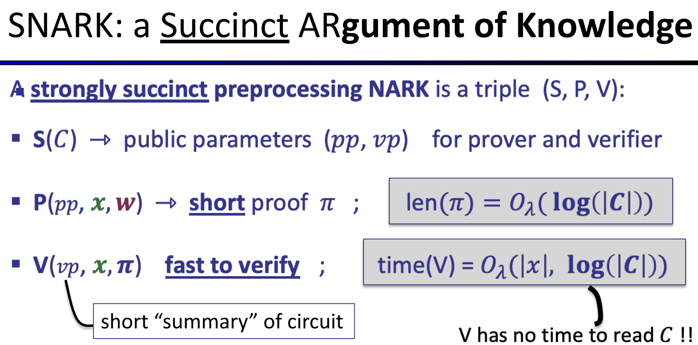

实践中的 SNARK 实际上会非常简洁(**strongly succinct**)。

**strongly succinct**:意味着

- proof 不仅是 w 大小的次线性，证明长度必须是电路大小的对数关系.使证明与电路相比非常小！
- 验证证明的时间与 x 的大小成线性,且最多是电路规模的对数关系。

**意味着 Verifier 没有时间读取整个电路，也就是 Verifier 甚至不知道电路 C 是什么.也就无法验证一个语句**

**这就是为什么需要公共参数的原因，它为 Verifier 提供电路的 ****vp**** 摘要，以便在 ****log****(∣****C****∣)内足以运行验证。**

ZK-SNARK 就是零知识的 SNARK

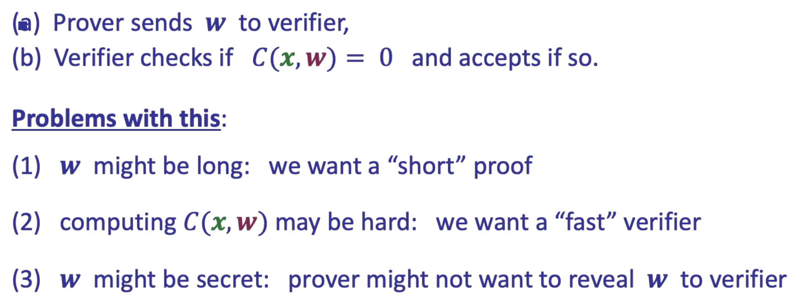

像 NARK 一样,考虑一个 trival SNARK 的情况,如上图所示,发现 a trival SNARK 并不满足一个 SNARK 定义.

### Preprocessing Setup

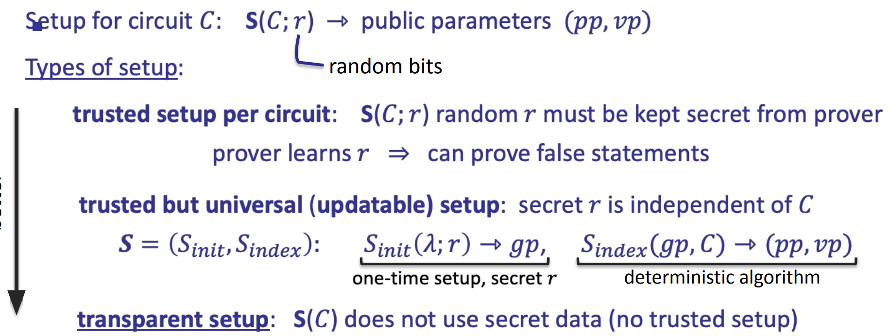

Setup 阶段读取整个电路 C,然后输出电路 C 的摘要-一些公共参数,包括 Prover 会用到的 PP 与 Verifier 会用到的 VP.

Setup 阶段通常会采用一些随机位 r 用于生成参数的过程，可分为以下几类

- Trusted setup per circuit:每一个电路都需要重新执行一次 Setup 过程.随机数 r 非常重要,应当保证 Setup 阶段后 r 被销毁(**可信**),否则其将能够伪造 proof.
- Trusted and universal setup:将 Setup 分为两个阶段

  - $S_{init}(\lambda,r) ->gp$:是个一次性的算法,产生全局参数 gp.该阶段完成后,r 就被销毁.所以 init 阶段需要是可信的,但该阶段可以**用于很多电路.**
  - $S_{index}(gp,C) ->(pp,vp)$:是一个确定性算法,为证明者和验证者生成参数。任何人都可以运行该算法并验证参数是否正确生成。
- Transparent setup:不需要任何秘密值，因此任何人都可以验证它是否正确运行，并且不需要运行可信设置.比如 STRAK 协议

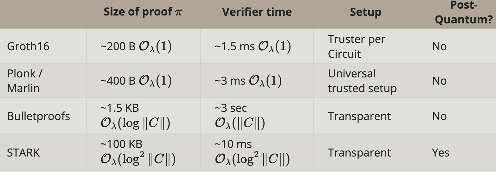

## Building an efficient SNAKR


一个通用的构建 SNARK 的范例,包含两步或者说两个组件.functional Commitment Scheme 与 Interactive oracle proof.

Commitment 方案是一个**加密对象**，这意味着它的安全性取决于某些密码学假设。

IOP 交互式预言机证明实际上是一个**信息论对象**,可以在没有任何底层假设的情况下无条件地证明 IOP 的安全性

### Commitment 承诺

简单回顾


#### 承诺性质

- **Hiding:意味着敌手获得承诺 c(m)后无法获得 m 的值**

  - computational hiding:对于任意的 PPT 敌手 A.有
    
  - Perfect hiding:将 A 的计算能力修改为无穷算力,“≤ negl(λ)”替换为 0
- **Binding:是指一个承诺 c(m) 在 Open 阶段打开只会为一个值 m 而不会得到 m‘.**

  - computational  Binding
    
  - perfect binding::将 A 的计算能力修改为无穷算力,“≤ negl(λ)”替换为 0

有一个使用哈希函数的标准承诺构造。哈希函数 _H_:M×R→C，其中

- _commit_(_m_,_r_)=_H_(_m_,_r_)
- _verify_(_m_,_com_,_r_)=accept if _com_=_H_(_m_,_r_)

#### Commitment to a Function


- 选择一个函数族: F={_f_:X_→Y}. f 表示从集合 x 到集合 y 的函数
- Prover 运行 Commit 算法,将函数 f 与随机数 r 作为输入, $com_f$ 为输出.f 可以表示为一个电路 C，一个 C 程序等。

然后将 $com_f$ 发送给 Verifier

- Verifier 可以发送回一个函数域中的元素 x
- Prover 将 x 对应的 f(x)=y,以及 proof 发送给 Verifier. Proof 表明 1.f(x)=y 2.f 属于 F

形式上讲， Function Commitment Scheme 由以下定义：

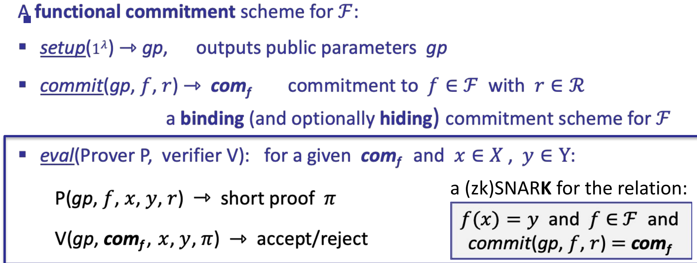

- setup_($1^λ$)→gp 输出公共参数 _gp_ 。
- commit(gp,f,r)→ $com_f$  用随机数r∈R 承诺 f∈F

  - 构建 SNARK,必须满足 Binding
  - 对于 **hiding**, 构建 SNARK 并非必须满足,  但当构建 zk-SNARK 需要满足该属性
- _eval_(_P_,_V_) :对于给定$com_f$和 x∈X,y∈Y ：

  - _Prover_(_gp_,_f_,_x_,_y_,_r_)→π:生成一个简短的证明
  - _V_(_gp_, $com_f$ ,_x_,_y_,_π_)→accept or reject
  - _事实上,Prover 与 Verifier 之间的 eval_ 算法是对以下关系的(zk)SNARK 证明:
         1.f(_x_)=_y_ 2. _commit_(_pp_,_f_,_r_)= $com_f$ 3. f∈F

##### Examples of functional commitments

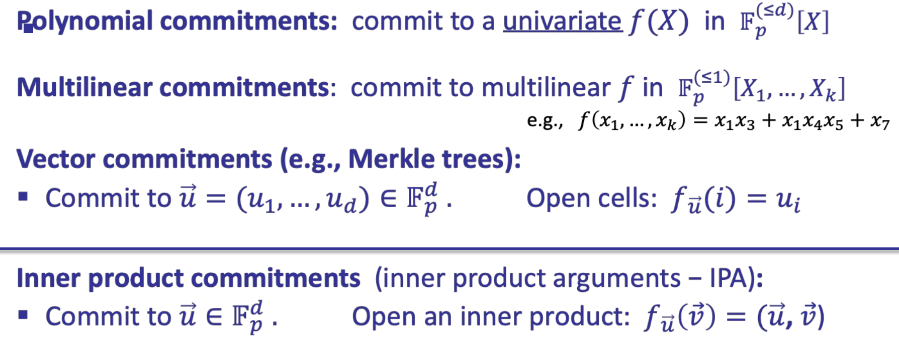

- 多项式承诺：承诺对象是单变量多项式, $f(X)∈F_p^{(≤d)}[X]$ :表示所有次数最多为 d 的单变量多项式的集合。
- 多线性承诺：承诺为多线性多项式，其中 $F_p^{(≤1)}[X_1,…,X_k] $:表示是 k 个变量的所有多线性多项式的集合，每个变量的次数最多为 1。

  - 多线性多项式示例： $f(x1,…,x7)=x_1x_3+x_1x_4x_5+x_7$
- 向量承诺：承诺对象是一个向量, $u=(u1,…,ud)∈F_p^d$ 。能够打开该向量中的任何特定单元格。在给定索引 i 的情况下,证明索引 i 处的该函数值 $f_u(i)=u_i$ .

  - 向量承诺方案实例:默克尔树(Merkle tree)
- 内积承诺：承诺一个向量 $u∈F_p^d$ ,并定义一个函数 $f_u$ ,该函数接受另外一个向量 v 作为输入,并且输出两个向量的内积(u,v).

**对于这 4 个承诺方案,可以从中任意一个基础上构建获得剩余承诺方案。**

#### Polynomial Commitment Scheme

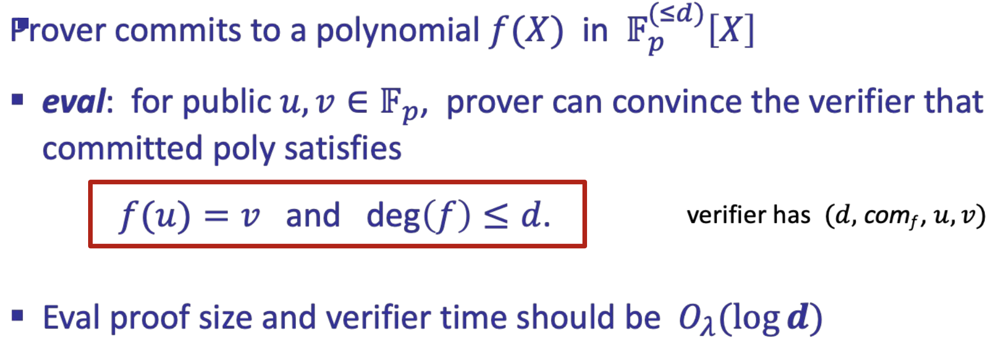

Prover 需要对多项式 $f∈F_p^{(≤d)}[X]$ 承诺.Prover 试图说服 Verifier , $com_f$ 满足

1. 1.f(u)=v ,其中 u,v∈Fp 且公开可见
2. f 的 degree≤d.

我们希望证明是一个 SNARK，那么证明大小和验证时间应该是 O(log_d_),下面是一些 PCS 的实现机制

- Using bilinear groups: **KZG'10** (trusted setup,也是**实际中使用最多的**), **Dory'20** (transparent,相比 kzg 慢)
- 仅使用哈希函数：基于 FRI（long eval proofs）
- 仅使用常规的椭圆曲线,不需要额外的结构: **Bulletproofs** (short proof, but verifier time is O(_d_))
- Using groups of unknown order: **Dark'20(慢,未获得太多关注)**

考虑 **travial** 的 PCS 情况,用系数表示的方式表示多项式 f, $f(x)=\sum_0^da_ix^i$ ,过程如下

- $$
  commit(f,r)=H((_0,a_1,…,a_d),r)
  $$
- _eval_ 将按如下方式完成：

  - Prover 将 π = $((a_0,a_1,…,a_d),r)$ 发送给 Verifier
  - verifier 从系数重构 _f_ ，并检查是否 _f_(_u_)=_v_ 和 $H((a_0,a_1,…,a_d),r)=com_f $.

很明显这**不符合 SNARK 的要求**,因为证明大小和验证时间与 _d_ 是线性关系的,而不是 O(log d)

##### Polynomial is Zero

这是 SNARK 的重要组成部分，也是使 SNARK 成为可能的重要原因

考虑最多为_d_ 次的非零多项式 $f∈F_p^{(≤d)}[X]$ 

 $r←F_p,Pr[f(r)=0]≤\frac{d}{p}$ :从有限域选择一个随机元素 r ,f(r)=0 的概率为 d/p

这是因为 f 最多有 d 个根,_r_ 是从大小 _p 的域_ 中随机选择的.r 命中 d 个根的概率为 d/p.

考虑当 p 远远大于 d 的情况下,比如 $p≈2^{256} 和 d≤2^{40}$, _d_/_p_ 可以忽略不计.这意味着当$f(r)=0 ， r←Fp$,Verifier 有着非常高的概率相信多项式在所有点上都为 0.

判断一个多项式是否为 0,只需一个随机点进行评估,并检查评估值是否为零即可。

对应[[Schwartz-Zippel-DeMillo-Lipton]](https://en.wikipedia.org/wiki/Schwartz%E2%80%93Zippel_lemma)定理.该定理也适用于多元多项式,将 d 理解为 f 的总 degree 之合即可.比如 $f=x^2+y^3 ,d=5$

##### Two Polynomials are equation

设 $f,g∈F_p^{(≤d)}[X],r←Fp$ 如果 $f(r)=g(r).则f(r)-g(r)=0.则f-g=0$ ,那么 f=g 的概率非常高.

下面给出判断两个多项式是否相等的**交互式**协议


1. V 从 Fp 中随机选择一个随机数 r,将 r 发送给 P
2. P 根据发来的 r,分别计算 f(r)与 g(r)的值为 y 与 y‘.将 y 与 y’以及对应的 proof 给 V
3. V 首先检查 proof 是否有效,然后检查 y 是否等于 y‘

通过承诺与 F-S 转换,将上述协议转为 SNARK 方案.

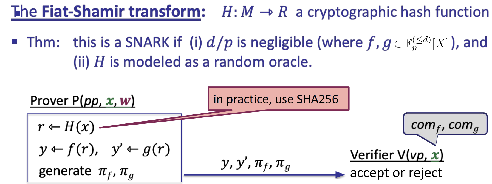

- 上图是一个 SNARK 方案,当

  - d/p 可忽略
  - 哈希函数 H 作为一个 **Oracle**,即 H 可自行获得随机质询，然后计算对对应的响应，并将响应发送给 P
- 该 SNARK 中,Statement x 是 f 与 g 对应的承诺 $com_f,com_g$;witness w 是 f 与 g 本身.
- **F-S 转化**为非交互式 SNARK:P 通过 H(x)获得随机数 r,不再需要 V 发送 r.因为 V 同样能拿着 x 询问 Oracle,获得 r.
- 但这**不是一个 zk-snark**,因为 V 可以学习到多项式 f,g 在 r 处的值 y 与 y‘.

#### Inner product argument

证明者通过内积论证可利用**循环****递归**的方式**证明他拥有两个公开向量承诺的消息, 且这两个消息的内积等于某个公开值**. 对于长度为 n 的消息向量, 内积论证的通信复 杂度为 O(log n).

Prover 可向 Verifier 证明对于公共输入 $A, B ∈ G, g, h ∈ G^n$ 和公开标量 z∈Zq

P 拥有向量 a、b,满足 $A=g^a、B=h^b 和a·b=z$ 则 statement 为

${(g,h,A,B,z;a,b):A=g^a ∧B=h^b ∧a·b=z}$,其中向量 a,b 为 witness,g,h,A,B 为公共输入

内积论证的**核心思想**是将针对 n 长向量的 statement 根据 V 的随机挑战 c 归约为对 n/2 长向量的等价 statement,

在向量不断缩减至为标量后, P 只需要直接发送标量即可.

约定一些符号

- 1.固定群的生成元 g 后, 记 $g^r$ 为 [r], 令 n ∈ N, 记 $(g^{r_1} , g^{r_2} , · · · ,g^{r_n} ) 为 [R]$,[S]同理
- 设 g, h 的生成方式为 $g ← [R]$, $h ← [S]$
- 对于 n 为偶数的向量 $r=(r_1,r_2,···,r_n)$ (不是偶数可填充), 记 $r_{\frac{1}{2}}= (r_1,r_2,··· ,r_{\frac{n}{2}}), r_{\frac{2}{2}} = (r_{\frac{n}{2}+1},r_{\frac{n}{2}+2},··· ,r_n)$

**过程如下**

1. 首先基于 V 的随机挑战 c 构造长度一半于原密钥长度的承诺密钥, 即 $[r'] ← [c^{−1}r_{\frac{1}{2}} + c^{−2}r_{\frac{2}{2}} ]$
2. 为防止 P 利用新的承诺密钥 [r′] 作恶, P 需在挑战阶段之前发送部分承诺值 $A_{−1} = [a_{\frac{1}{2}} ·r_{\frac{2}{2}} ]和A_1 = [a_{\frac{2}{2}} ·r_{\frac{1}{2}} ]$. 此时新证据为 $a′ = ca_{\frac{1}{2}}  +c^2a_{\frac{2}{2}}$
3. P 和 V 计算新承诺: $A' ←[a' ·r']=[ ca_{\frac{1}{2}}  +c^2a_{\frac{2}{2}}·(c^{−1}r_{\frac{1}{2}} + c^{−2}r_{\frac{2}{2}})=AA^{c^{−1}}_{-1}A_1^c$
4. 对于承诺密钥 [s]、承诺 B 和秘密输入 b, 利用挑战 c 的逆 $c^{-1}$ 构造对应的承诺密钥 [s′]、新证据 b′ 和承诺值 B′ ,即 $[s']←[cs_{\frac{1}{2}} +c^2s_{\frac{2}{2}}], b' ←c^{−1}b_{\frac{1}{2}} +c^{−2}b_{\frac{2}{2}}, B' ←[b' ·s']=B^c_{-1} BB^{c^{−1}}_1$
5. 对于 z,P 需在挑战阶段前构造 $z_{-1} ←a_{\frac{2}{2}} ·b_{\frac{1}{2}} 和z_1 ←a_{\frac{1}{2}} ·b_{\frac{2}{2}}$
6. 更新后的 $z' ←a'·b' =z_{−1}c+z+z_1c^{-1}$
7. 归约后的新陈述为 ${([r'],[s'],A',B',z';a',b') : A' = [a' · r'] ∧ B' = [b' · s'] ∧ a' · b' = z')}$
8. .....递归规约

### IOP:Interactive Oracle Proof

F -IOP 的目标是将 _f_∈F 的承诺转为通用电路的 SNARK。例如，对于一个多项式函数族 $F=F_p^{(≤d)}[X]$ ，使用 F -IOP，可以将其转换为任何电路大小为 ∣_C_∣<_d_ 的 SNARK。

**Definition:****C****(****x****,****w****) 是某些算术电路。 **$x∈F_p^n$**  .F -IOP 是一个证明系统，用于证明 ∃****w****:****C****(****x****,****w****)=0 **

**Setup**: _S_(_C_)→(_pp_,_vp_),其中 $vp=(\boxed{f_0},\boxed{f_{−1}},…,\boxed{f_{−s}})$ 是函数的 Oracle.即 vp 可以理解为 V 可查询的一堆 Oracle,V 可以要求某个给定值显示函数结果,过程如下

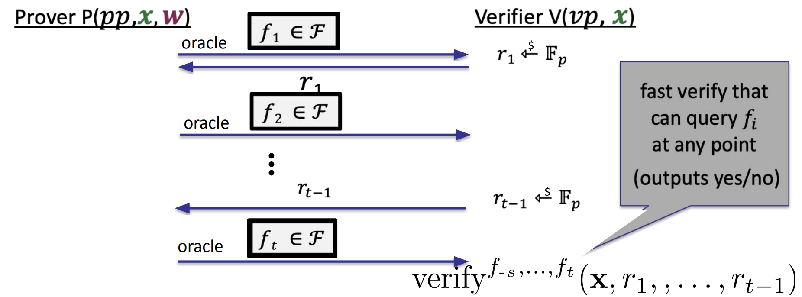

- P 首先发送函数 f1 的 Oracle $\boxed{f_1}$。V 稍后可以在其选择的任何点对 f 进行评估.在实际中, $\boxed{f_1}=commit(f_1)$
- V 从 Fp 中随机选择 r1 发送给 P.
- 重复 Step1 and Step2 t-1 轮
- P 最后发送 ft 的 Oracle $\boxed{f_t}$。
- V 开始验证,验证过程 V 可以访问 P 给出的所有 Oracle，以及所有生成的随机数 r 和公共输入 _x_

#### Properties of IOP

- **Completeness**:$∃w:C(x,w)=0⟹Pr[V    accepts]=1$
- Knowledge Soundness:在没有 w 的情况下,恶意 P 无法让 V 相信他知道一个 w,使得 C(x,w)=0

  - Extractor 可以访问 statement x 与函数 $f_1,f_2...f_s$ **本身**,因为对于这些函数本身的**承诺就是一个 SNARK**,所以 Ectractor 可以从 $com_f$ 中**提取 f 本身**,进而提取出 w.
- Zeroknowledge :可不满足

#### Example of IOP

Polynomial IOP for claim $X⊆W⊆F_p$,用电路 C 去表示该关系:$C(X,W)=0⟺X⊆W⊆F_p$,过程如下

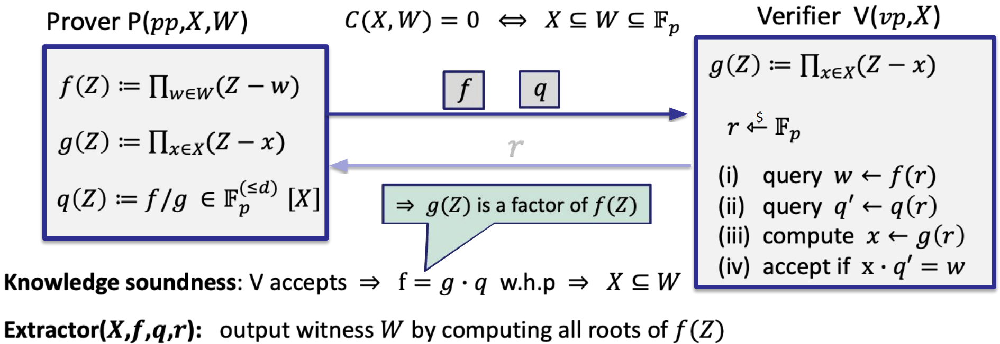

1. P 分别计算两个多项式 $f(Z)=∏_{w∈W}(Z−w),g(Z)=∏_{x∈X}(Z−x)$,V 也可计算 g(Z),因为 X 是公共的
2. P 计算一个商多项式 $q(Z)=f/g∈F_p^{(≤d)}[X]$,只有在 g 包含所有 f 根的情况下,q 才是一个多项式,即_X_⊆W.举个例子

比如 X={1,2},W={1,2,4} ,$f(Z)=(Z−1)(Z−2)(Z−4), g(Z)=(Z−1)(Z−2) ,q(Z)=f/g=(Z−4)$,只有_X_⊆_W,_q 才是一个有限域中的有效多项式

1. P 发送 $\boxed{f},\boxed{q}$ 给 V
2. V 发送一个随机数 r 给 P,虽然 P 不会用到 r,但仍然发送,这表明 r 是一个公共值
3. V 查询 $\boxed{f},\boxed{q}$ 在 r 点的值,记做 w 与 q‘.计算 g(r).验证 g(r)*q’=w 是否成立

**当我们设计 IOP 时，我们所要做的就是设计 P 向 V 发送哪些 Oracle，然后 V 在哪里查询这些 Oracle。**

实际中,可以**通过多项式承诺方案来实例化 IOP**，其中这些 Oracle 被来自 P 的承诺所取代，查询动作基本上通过将查询点发送给 P 来取代，P 进行评估并发回评估正确完成的证明。然后 V 可以决定是否接受或拒绝最终的证明。

#### IOP + 相应的 Polynomial 方案构造 SNARK

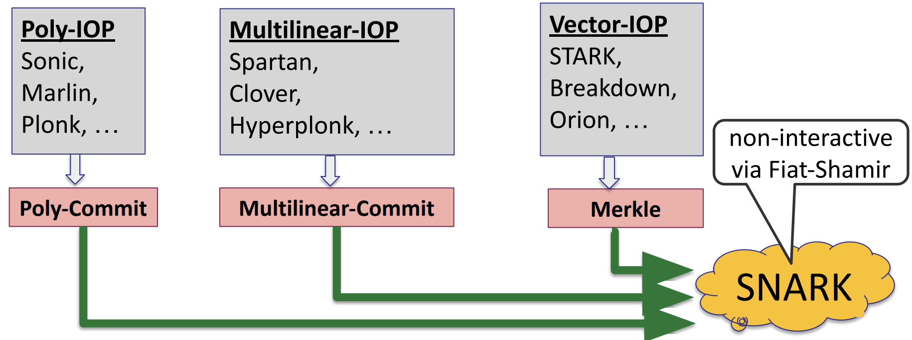

Snarks in Practice

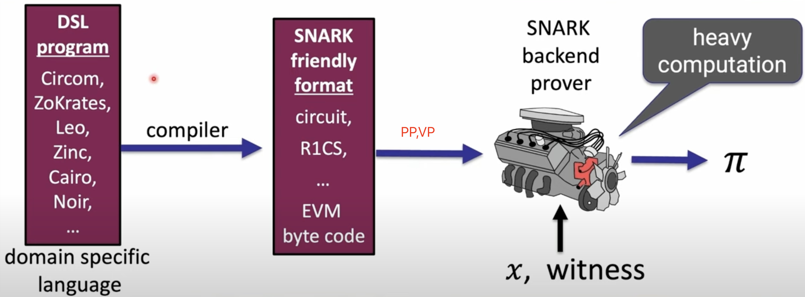
